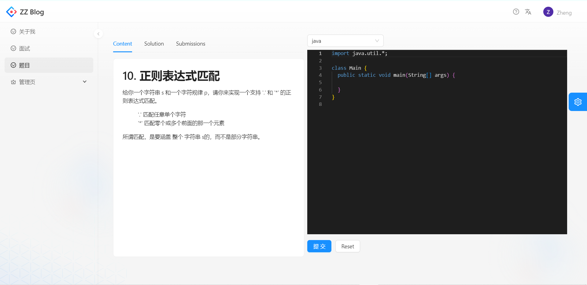
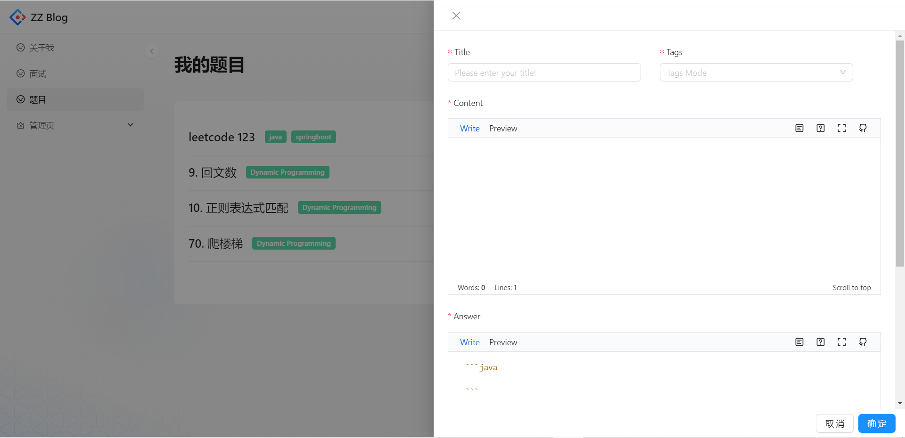
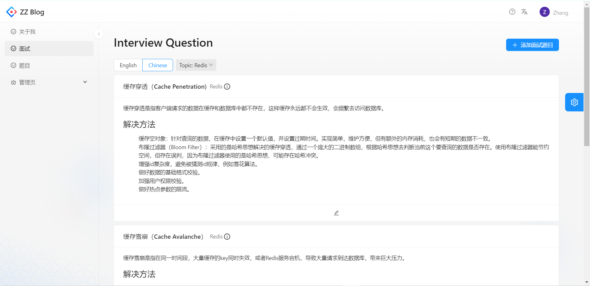

# 博客微服务

基于 Spring Cloud 微服务的博客系统。系统能够上传自己的面试题目笔记，也能够在代码沙箱中对代码进行 编译，运行并判断输出是否正确。

## 用户模块(user-service)

- [x] 注册
- [x] 登录
- [x] 退出
- [x] 用户管理
- [x] 签到和本月连续签到统计（redis bitmap）

## 面试题目模块(interview-service)

- [x] 添加面试题目：
  - [ ] 添加subtopic
  - [ ] 自定义题目顺序
- [x] 更新面试题目
- [x] 删除面试题目
- [x] 查询面试题目：
  - [ ] Elasticsearch

## 代码题目模块(question-service)

- [x] 添加面试题目
- [x] 更新面试题目
- [x] 删除面试题目
- [x] 查询面试题目：
  - [ ] Elasticsearch
- [ ] 代码结果和提交记录查询

## 代码校验模块(code-service)

- [x] 代码沙箱：
  - [x] 测试代码沙箱
  - [x] 本地代码沙箱
  - [ ] 第三方代码沙箱
  - [ ] 改进代码结构
  - [ ] 抽离成独立模块
  - [x] 代码模式
    - [x] JVM命令行参数
    - [x] ACM模式
    - [ ] 核心代码模式
- [x] 判断策略：
  - [x] 默认判断策略
- [ ] 程序安全控制(In Progress)
  - [x] 超时控制（守护线程）
  - [x] 限制资源分配（内存）
  - [ ] 限制用户操作权限（安全管理器）
  - [x] 运行环境隔离（Docker）
- [ ] 消息队列

## 网关模块（gateway-service）

- [x] 内部服务请求限制
- [x] 整合文档
- [ ] Sentinel网关层限流

## api模块（api-service）

- [x] UserClientFeign
- [x] QuestionClientFeign
- [x] CodeClientFeign

## 客服模块（chat-service）

- [x] 普通用户向在线管理员发送消息
- [ ] 更多在线聊天功能

## 客户模块（customer-service）

- [x] 抢购优惠卷
- [x] 超卖问题
  - [x] 乐观锁思想解决
- [x] 一人一单问题
  - [x] 单机下使用synchronized锁
  - [x] 编写lua脚本自定义reentrant lock
  - [ ] 使用redisson改进

### Nacos

- [ ] 配置管理

## 前端

[blog-frontend](https://github.com/Adair-zz/blog-frontend)

